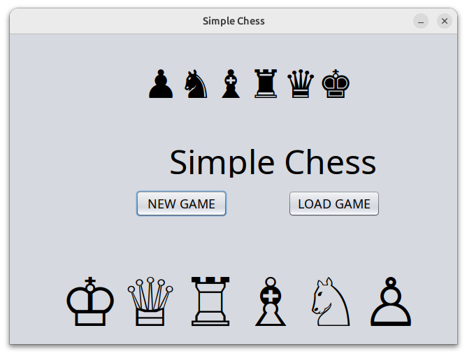
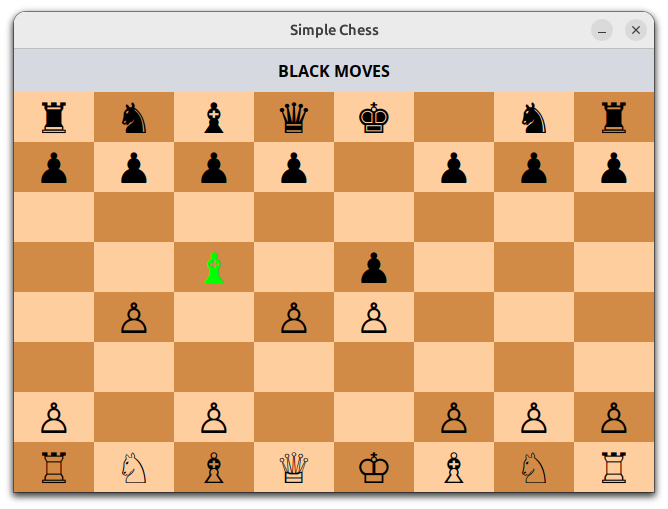

# Simple Chess

Simple educational Java chess application for local human-vs-human play.

The project provides a basic graphical chessboard, allows two players to play on the same machine, highlights the active piece, and validates basic piece movement rules. It was written as an educational / experimental project and does not include a chess engine or check/checkmate detection.

## Screenshots

## Features

* Local human-vs-human chess gameplay
* Graphical chessboard
* Basic move validation for chess pieces
* Highlighting of the selected / active piece
* Simple desktop UI

## Limitations

This is an educational / experimental chess project, not a complete chess engine.

Currently not implemented:

* Check detection
* Checkmate detection
* AI opponent / chess engine
* Advanced rule validation beyond basic piece movement

## Build and Run

Build instructions are available in [BUILD.md](BUILD.md).

## Notes

I originally wrote this project as a small student programming assignment. It was later cleaned up and given a simple build structure so it can be built and run more easily.

